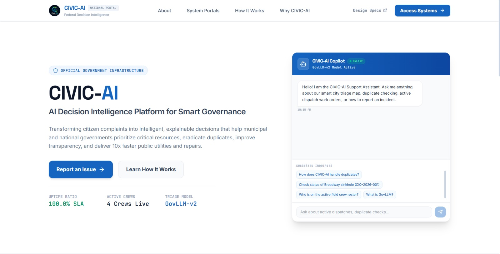
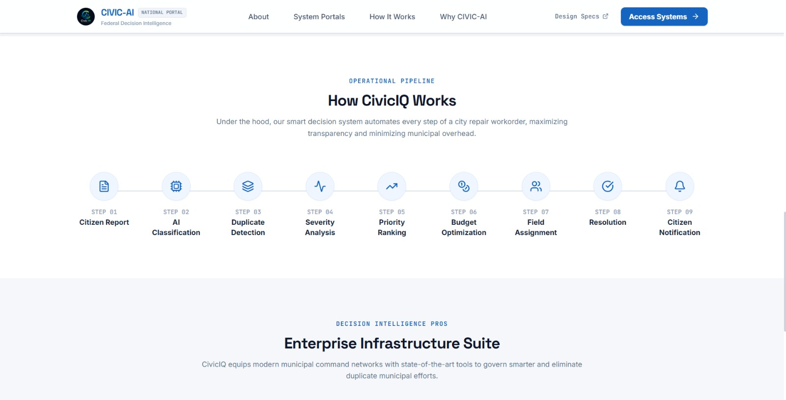
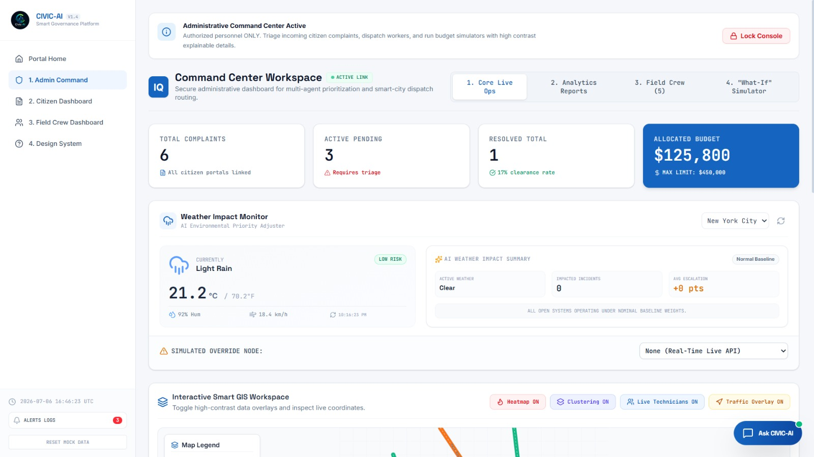
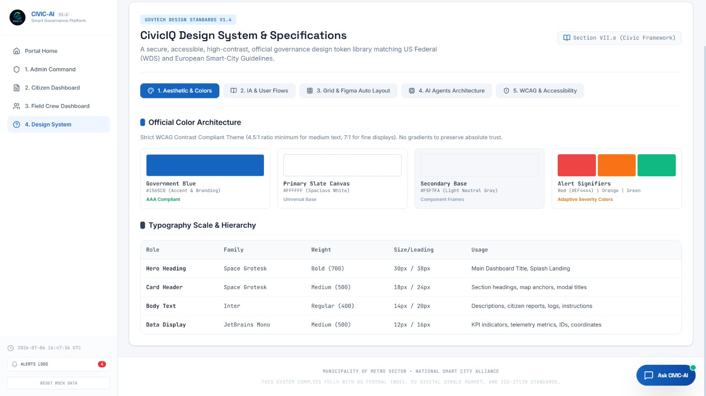

# 🏛️ CivicIQ

<h3 align="center">AI Decision Intelligence for Smart Civic Governance</h3>

<p align="center">
Transforming civic data into intelligent, transparent, and actionable decisions.
</p>

<p align="center">
  
  
  
  
  
</p>

---

## 🌍 Overview

**CivicIQ** is an AI-powered decision intelligence platform built to help governments, municipalities, and public administrators make smarter, faster, and more transparent decisions.

Instead of manually reviewing thousands of citizen complaints, reports, surveys, and civic datasets, CivicIQ uses Generative AI to summarize information, detect patterns, predict future risks, and recommend evidence-based policy actions—all from a unified dashboard.

---

# 🖥️ Demo

## Dashboard Preview

| Dashboard | AI Command Center |
|-----------|-------------------|
|  |  |

| Smart City Map | Civic Intelligence |
|----------------|--------------------|
|  |  |
---

# ✨ Features

### 🤖 AI Policy Advisor

Generate intelligent policy recommendations from civic data and citizen feedback.

### 📊 Administrative Command Center

Monitor city-wide KPIs, complaints, department performance, and trends in real time.

### 🗺️ Interactive GIS Map

Visualize complaints geographically with clustered markers and severity-based coloring.

### 💬 AI Civic Assistant

Natural language chatbot that helps officials understand complaints, trends, and recommended actions.

### 👥 Citizen Feedback Analysis

Automatically classify complaints, detect sentiment, identify duplicate reports, and summarize citizen concerns.

### 📈 Predictive Intelligence

Forecast future civic issues before they escalate using AI-powered analytics.

### ⚡ Smart Complaint Prioritization

Automatically prioritize issues using severity, location, impact, and urgency.

### 🌦️ Weather Impact Intelligence

Adjust complaint priority based on real-time weather conditions.

### 📑 Explainable AI

Every recommendation includes transparent reasoning instead of black-box predictions.

### 📊 Interactive Analytics

Modern dashboards with charts, KPIs, and visual insights for decision-makers.

---

# 💡 Why CivicIQ?

Modern governments generate massive amounts of civic data every day.

Unfortunately, converting that information into actionable decisions remains slow, manual, and expensive.

CivicIQ bridges this gap using Artificial Intelligence by helping administrators:

* Understand citizen concerns instantly
* Detect city-wide trends
* Prioritize complaints automatically
* Predict future civic risks
* Generate policy recommendations
* Improve transparency
* Allocate budgets more effectively

---

# 🏗️ Tech Stack

| Technology      | Purpose           |
| --------------- | ----------------- |
| React           | Frontend          |
| TypeScript      | Type Safety       |
| Vite            | Build Tool        |
| Groq API        | AI Reasoning      |
| Google Maps API | GIS Visualization |
| Tailwind CSS    | UI Design         |
| Lucide React    | Icons             |

---

# 📂 Project Structure

```text
src
│
├── components
│   ├── dashboard
│   ├── map
│   ├── chat
│   ├── analytics
│   └── common
│
├── services
│
├── hooks
│
├── utils
│
├── data
│
└── App.tsx
```

---

# 🚀 Getting Started

## Prerequisites

* Node.js 18+
* npm
* Groq API Key
* Google Maps API Key

## Installation

Clone the repository

```bash
git clone https://github.com/tiru-venkatesh/civic-ai.git
```

Navigate into the project

```bash
cd civic-ai
```

Install dependencies

```bash
npm install
```

Create a `.env.local`

```env
VITE_GROQ_API_KEY=////////////////
VITE_GOOGLE_MAPS_API_KEY=/////////////
```

Run locally

```bash
npm run dev
```

Production build

```bash
npm run build
```

---

# 💼 Use Cases

* 🏙️ Smart Cities
* 🛣️ Infrastructure Planning
* 🚨 Disaster Response
* 🚮 Waste Management
* 🚦 Traffic Analysis
* 💧 Water Supply Monitoring
* 🚓 Public Safety
* 📋 Municipal Administration
* 📢 Citizen Engagement
* 💰 Budget Prioritization
* 🏛️ Policy Planning

---

# 🔄 Workflow

```text
Citizens
        │
        ▼
Complaints + Images + Reports + Civic Data
        │
        ▼
AI Analysis (Groq)
        │
        ├── Complaint Classification
        ├── Sentiment Analysis
        ├── Duplicate Detection
        ├── Priority Scoring
        ├── Trend Detection
        └── Policy Recommendations
        │
        ▼
Administrative Dashboard
        │
        ▼
Smarter Government Decisions
```

---

# 🎯 Key Highlights

✅ AI Copilot for Government

✅ Interactive Smart City Map

✅ Explainable AI Recommendations

✅ Weather-Aware Complaint Prioritization

✅ Predictive Civic Analytics

✅ Complaint Severity Detection

✅ Administrative Dashboard

✅ Real-time Insights

---

# 🛣️ Roadmap

* [ ] Live Government Data APIs
* [ ] Multi-language Support
* [ ] Voice-enabled Civic Assistant
* [ ] Department-wise Dashboards
* [ ] PDF Report Generator
* [ ] Excel Export
* [ ] Authentication & RBAC
* [ ] Mobile Responsive Dashboard
* [ ] IoT Sensor Integration
* [ ] Predictive Budget Allocation

---

# 🤝 Contributing

Contributions are welcome!

1. Fork the repository
2. Create your feature branch

```bash
git checkout -b feature/amazing-feature
```

3. Commit changes

```bash
git commit -m "Add amazing feature"
```

4. Push

```bash
git push origin feature/amazing-feature
```

5. Open a Pull Request

---

# 📄 License

Distributed under the MIT License.

---

# 👨‍💻 Author

**Tiru Venkatesh**

AI Builder • Full Stack Developer • Building AI-powered products for Smart Governance.

GitHub:
https://github.com/tiru-venkatesh

---

# ⭐ Support

If you found this project helpful, consider giving it a ⭐ on GitHub.

Your support motivates future development and helps more developers discover CivicIQ.

---

<p align="center">
Made with ❤️ for smarter cities and better governance.
</p>
